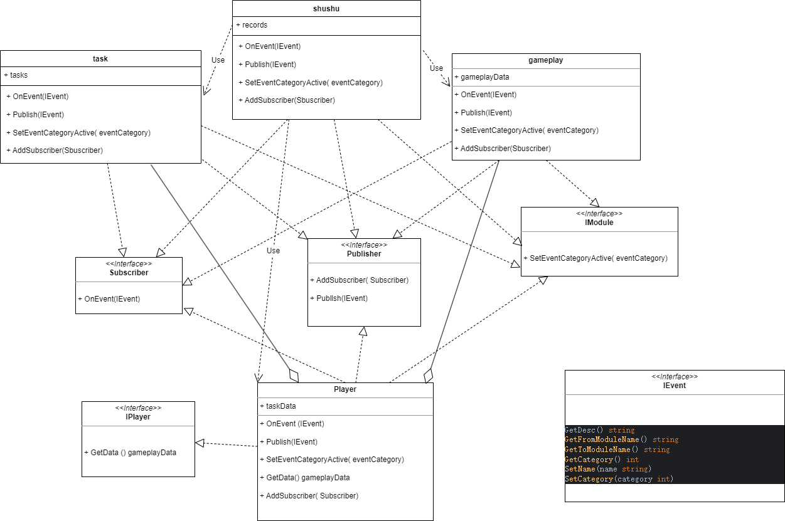

# `greatestworks`

 `greatestworks` is a  framework which include  the back-end logic of game . 

## 初衷 （original intention）

* 1.充分发挥 golang 语言特性 (Give full play to the features of golang language)

* 2.微服务思想,低耦合 (Micro service idea, low coupling)

* 3.面向对象+组合 (Object oriented+combination)

* 4.高性能 (High performance)

* 5.事件驱动 (Event driven)

### 目录结构说明
* `aop`
  - 面向切面的逻辑
* `server`
  - 各个节点服务,include login ,gateway ,world,battle
* `internal`
  - include module,event,record 
* `gre`
  - 运维，部署，工具(createmodule;exel2json)等

### `module` 说明

每个模块包含
* `data`
  - 对应的数据存储
* `system`
  - 该模块的管理，例如数据的CRUD，有 `system` 的模块，其成员实例不具备 独立处理协程.
* `iplayer`
  - 定义player需要实现的些方法
* `handler`
  - 处理从属模块需要的业务逻辑
* `I*`
  - 模块成员的抽象，接口定义,`eg:INpc`
* `config`
  - 配置,常量的定义等
* `module`
  - 模块的管理与维护，例如 event (事件)的处理
* `on_event`
  - 事件处理
 

模块与模块之间的联系通过 `player` 为中介，以事件订阅，发布的形式处理  
每个模块会管理自己激活的事件

### `Player`

 每个 `Player` 实例 拥有自己的协程

### `Scene`

 每个 `Scene` 实例 拥有自己的协程

### `task`
  * 支持配置多协程处理业务逻辑
  - `Data` 存放 玩家任务实例数据
  - `impl` 任务类型的实现
### `idea` 

  * 模块之间依赖的属性，借助 `redis` ,`mongo`,`consul`,`nsq`,`rabbitmq`
  * 服务节点之间的依赖，借助 `redis` ,`mongo`,`consul`,`nsq`,`rabbitmq` 
  * 服务节点之间的通讯，通过 `rpc`, `tcp`,`nsq`,`rabbitmq`
  * 客户端与逻辑服务器之间的通讯，通过  `tcp` , `kcp` ,`quic` 
  * 客户端与登录服之间的通讯，通过 `https`
---------------------------------------------------------------------
  * 系统模块支持 动态 开关
  * 协议层 约束参数传递，防外挂
  * GM 走上帝模式 不用登录某个玩家账号
  * 支持无死角压测，模块级别压测
  * 事件驱动
  * 模块级别 性能参数上报
  * 数数日志埋点 支持无死角覆盖
  * 支持 动态扩展，收缩
  * 代码优雅,命名合理有意义,阅读性高
----------------------------------------------------------------------
  * 不在单层直接handle消息,分级分发给各个子协程handle,是突破并发瓶颈必然选择 
    - 1.由于每个模块处理业务速度，频率是不一样的
    - 2.分散风险，当一个玩法出现不能玩，可以做到不影响其他玩法正常玩

### `deployment`
 
  * docker + k8s
  